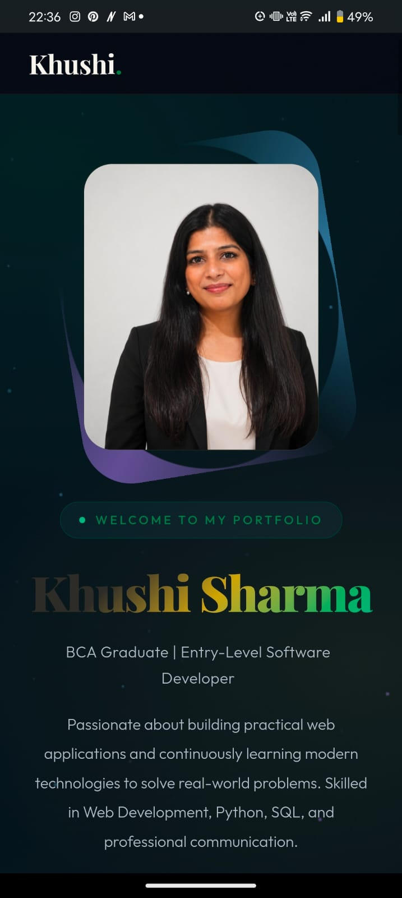

<div align="center">

# Khushi Sharma — Portfolio Website

### Modern Personal Portfolio • Frontend Development • UI/UX Focus

<p align="center">
  
</p>

<p align="center">
A modern personal portfolio website built to showcase my skills, projects, technical background, and frontend development journey through a clean and professional user experience.
</p>

<p align="center">


</p>

### Live Website

**https://khushisharma7891.github.io/portfolio/**

</div>

---

## About The Portfolio

This portfolio represents my work, technical skills, projects, and frontend development journey in a structured and visually professional way.

The purpose of this website is to create a strong first impression through a clean design system, thoughtful interactions, and an experience that reflects both technical and creative skills.

The portfolio focuses on:

- Clean visual hierarchy
- Professional presentation
- Responsive experience
- Smooth interactions
- Modern frontend aesthetics
- Usability-focused design

Rather than overcomplicating the experience, the website follows a minimal and modern approach while maintaining a polished visual identity.

---

## Design Direction

The website follows a **modern tech-inspired design language** with emphasis on simplicity, readability, and visual balance.

### Design Highlights

- Glassmorphism-inspired UI
- Clean dark visual experience
- Smooth micro-interactions
- Elegant typography system
- Soft visual depth
- Premium card-based layouts
- Consistent spacing and alignment

---

## Typography

### Fonts Used

**Headings** → Sora  
**Body Text** → Inter

The typography system was selected to maintain readability while giving the interface a clean and modern feel.

---

## Icons & Visual Assets

<p>

</p>

**Libraries & Assets**

- Lucide Icons
- Font Awesome
- SVG-based visuals

---

## Key Features

### Premium Interface

- Modern dark UI
- Clean layout structure
- Improved readability
- Strong visual hierarchy
- Consistent spacing system

### Interactive Experience

- Smooth hover interactions
- Elegant transitions
- Micro animations
- Interactive project cards

### Responsive Design

Optimized for:

- Desktop
- Laptop
- Tablet
- Mobile Devices

---

## Portfolio Sections

The portfolio includes the following sections:

- Hero Section
- About
- Skills
- Projects
- Education & Experience
- Contact
- Footer

---

## Tech Stack

### Frontend

<p>

</p>

### Design & UI

- Glassmorphism Effects
- Responsive Design
- CSS Animations
- Modern Typography System

### Development Tools

<p>

</p>

---

## Project Philosophy

The objective behind this portfolio was not to overload the experience with unnecessary complexity, but to present content in a clean, premium, and recruiter-friendly way.

The focus remains on creating a polished frontend experience that reflects attention to:

- UI Design
- Responsiveness
- User Experience
- Visual Consistency
- Performance

---

## Folder Structure

```bash
portfolio/
│── index.html
│── style.css
│── script.js
│── assets/
│── images/
│── README.md
```

---

## Future Improvements

Planned enhancements include:

- Advanced UI animations
- Improved interaction design
- Additional frontend polish
- Performance optimization
- Accessibility improvements

---

## Contact

### Portfolio Website

**https://khushisharma7891.github.io/portfolio/**

### LinkedIn

**https://www.linkedin.com/in/khushi-sharma-6601672b1**

---

## Author

**Khushi Sharma**  
Frontend Developer • UI/UX Enthusiast

GitHub:  
**https://github.com/khushisharma7891**

---

<div align="center">

Designed & Developed by **Khushi Sharma**

</div>
